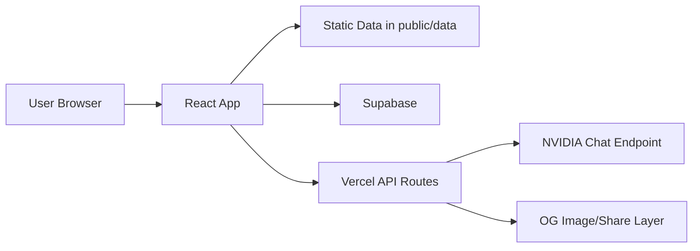

<div align="center">

# KCETCoded

Comprehensive counseling intelligence platform for KCET and COMEDK aspirants.

[](https://react.dev/)
[](https://www.typescriptlang.org/)
[](https://vitejs.dev/)
[](LICENSE)

</div>

---

## Table of Contents

- [1. Executive Summary](#1-executive-summary)
- [2. Vision, Motivation, and Scope](#2-vision-motivation-and-scope)
- [3. Product Modes (KCET and COMEDK)](#3-product-modes-kcet-and-comedk)
- [4. Feature Atlas](#4-feature-atlas)
- [5. Complete Route Map](#5-complete-route-map)
- [6. Data Foundation and Coverage](#6-data-foundation-and-coverage)
- [7. Architecture Overview](#7-architecture-overview)
- [8. Tech Stack](#8-tech-stack)
- [9. Repository Structure](#9-repository-structure)
- [10. Local Development](#10-local-development)
- [11. Script Reference](#11-script-reference)
- [12. Admin and Operations](#12-admin-and-operations)
- [13. Security, Privacy, and Trust](#13-security-privacy-and-trust)
- [14. Known Limitations and Caveats](#14-known-limitations-and-caveats)
- [15. Roadmap Direction](#15-roadmap-direction)
- [16. Additional Documentation](#16-additional-documentation)
- [17. Contributing](#17-contributing)
- [18. License](#18-license)

---

## 1. Executive Summary

KCETCoded is a student-built platform that transforms difficult-to-use counseling data into practical planning tools. It combines rank prediction, cutoff exploration, college discovery, planning/simulation, review and moderation systems, and exam-prep utilities in one product surface.

The platform now supports two operational environments:

- `KCET` mode
- `COMEDK` mode

Both are integrated into the same app shell, with mode-aware navigation, mode-aware core routes, and separate datasets.

Important: KCETCoded is an independent project and is **not an official KEA/COMEDK authority**. Always verify high-stakes decisions from official notices and source PDFs.

---

## 2. Vision, Motivation, and Scope

### Why this exists

Counseling data is public, but often operationally inaccessible to students under time pressure. KCETCoded exists to close that gap by offering:

- fast search and filtering over large cutoff datasets
- rank-to-options conversion for realistic college planning
- process support (documents, rounds, planning flows)
- source-link trust workflows for verification
- community-backed quality signals (reviews, discussions, reports)

### Problem framing

The platform is built around practical student questions:

- "What colleges are realistic for my rank/category?"
- "How did this cutoff move across rounds and years?"
- "How should I order preferences without regret?"
- "Which options are practical for commute and everyday life?"

### Product scope

KCETCoded is not a single calculator. It is a multi-surface counseling operating layer with:

- data exploration tools
- prediction tools
- planning and simulation tools
- community and moderation tools
- practice and engagement tools
- admin operations

---

## 3. Product Modes (KCET and COMEDK)

`src/contexts/ExamModeContext.tsx` drives the global exam mode and persists the selected mode in local storage using:

- `kcet.exam-mode.v1`

Mode changes:

- `/rank-predictor` behavior (KCET predictor vs COMEDK predictor)
- `/cutoff-explorer` behavior (KCET explorer vs COMEDK explorer)
- dashboard copy/actions
- sidebar command labels and community links

Dedicated COMEDK route also exists:

- `/comedk-explorer`

---

## 4. Feature Atlas

### 4.1 Admission intelligence

| Feature | Purpose | Notes |
| --- | --- | --- |
| Rank Predictor | KCET expected-rank modeling from marks + PUC% | Share/download workflows included |
| COMEDK Rank Predictor | COMEDK marks-to-rank model | Community point driven (2025 set) |
| Cutoff Explorer | High-volume KCET cutoff search/filter | Source-linked PDF mapping support |
| COMEDK Explorer | COMEDK-focused cutoff exploration | GM/HKR/KKR + round/year filtering |
| College Finder | Rank/category based college-branch matching | Bookmarking, comparison, export |
| College Cutoffs | College-first matrix view | Category group filtering |
| College Detail | Per-college trend context | Branch/cutoff detail surface |

### 4.2 Planning and execution support

| Feature | Purpose | Notes |
| --- | --- | --- |
| Mock Simulator | Preference-order simulation | Beta-toned, uses historical data |
| Planner | Option-entry PDF parse + handoff | Wrapped in error boundary |
| Round Tracker | Process timeline guidance | Planning support |
| Documents | Counseling checklist | Readiness support |

### 4.3 Knowledge and guidance

| Feature | Purpose |
| --- | --- |
| Info Centre | Long-form counseling explanations |
| CET News | Curated/generated KCET update feed |
| Materials | Resource shelf |
| AI Counselor | Exploratory guidance with disclaimers |

### 4.4 Community and quality loops

| Feature | Purpose |
| --- | --- |
| Reviews | College reviews, ratings, filtering |
| Review Reports | Community moderation intake |
| Feature Request | Product feedback channel |
| Admin moderation views | Operational triage and cleanup |

### 4.5 Practice and engagement

| Feature | Purpose |
| --- | --- |
| Daily Challenge | Daily question flow with streak persistence |
| PYQ Test | Chapter/quiz-based previous-year practice |
| Cutoff Clash | Higher/lower style cutoff intuition game |

### 4.6 Labs and practical decision surfaces

| Feature | Purpose |
| --- | --- |
| Squad Finder | Group-fit college discovery for friends |
| Metro Mapper | Metro-accessibility college filtering |
| BMTC Mapper | Bus-route accessibility filtering |
| Hidden Gems | Underrated/value-oriented college surfacing |

### 4.7 Platform layer

| Component | Purpose |
| --- | --- |
| Command Palette (`Ctrl/Cmd + K`) | Fast navigation and command search |
| Keyboard HUD (`?`) | Shortcut discoverability |
| Donation surfaces | `Donate` page + floating support button |
| PWA install banner | Installability support |
| Disclaimer banner | Continuous verification reminder |

---

## 5. Complete Route Map

`src/App.tsx` currently contains:

- `36` route declarations
- `34` unique route paths
- duplicate declaration for `/college-cutoffs`

### 5.1 Active unique routes

| Route | Component | Context |
| --- | --- | --- |
| `/` | `Homepage` | Standalone |
| `/daily-challenge` | `DailyChallenge` | Standalone |
| `/cutoff-clash` | `CutoffClash` | Standalone |
| `/dashboard` | `Dashboard` | Layout |
| `/rank-predictor` | `ExamAwareRankPredictor` | Mode-aware |
| `/cutoff-explorer` | `ExamAwareCutoffExplorer` | Mode-aware |
| `/comedk-explorer` | `ComedkExplorer` | Layout |
| `/college-finder` | `CollegeFinder` | Layout |
| `/mock-simulator` | `MockSimulator` | Layout |
| `/round-tracker` | `RoundTracker` | Layout |
| `/college-compare` | `CollegeCompare` | Layout |
| `/planner` | `Planner` | Layout |
| `/documents` | `Documents` | Layout |
| `/reviews` | `Reviews` | Layout |
| `/reviews/:collegeCode` | `CollegeReviewPage` | Layout |
| `/college-list` | `CollegeCutoffs` | Layout alias |
| `/college-cutoffs` | `CollegeCutoffs` | Layout |
| `/info-centre` | `InfoCentre` | Layout |
| `/materials` | `Materials` | Layout |
| `/cet-news` | `CETNews` | Layout |
| `/ai-counselor` | `AICounselor` | Layout |
| `/college/:collegeCode` | `CollegeDetail` | Layout |
| `/privacy` | `PrivacyPolicy` | Layout |
| `/terms` | `Terms` | Layout |
| `/about` | `About` | Layout |
| `/request-feature` | `FeatureRequest` | Layout |
| `/pyq-test` | `PYQTest` | Layout |
| `/donate` | `Donate` | Layout |
| `/squad-finder` | `SquadFinder` | Standalone |
| `/metro-mapper` | `MetroMapper` | Standalone |
| `/bmtc-mapper` | `BmtcMapper` | Standalone |
| `/hidden-gems` | `HiddenGems` | Standalone |
| `/admin` | `AdminHub` | Hidden/admin |
| `*` | `NotFound` | Fallback |

---

## 6. Data Foundation and Coverage

### 6.1 KCET cutoff dataset

- Source file: `public/data/kcet_cutoffs_high_volume.json`
- Rows: `216,893`
- Years: `2023`, `2024`, `2025`
- Rounds: `MOCK`, `R1`, `R2`, `R3`
- Category labels: `24`

### 6.2 COMEDK cutoff dataset

- Source file: `public/data/comedk_cutoffs.json`
- Rows: `12,237`
- Years: `2022`, `2023`, `2024`, `2025`
- Rounds: `MOCK`, `R1`, `R2`, `R2P1`, `R2P2`, `R3`, `R4`
- Categories: `GM`, `HKR`, `KKR`

### 6.3 Additional datasets

- College list: `public/colleges-list.json` (`232` records)
- PYQ bank: `src/data/pyqQuestionBank.ts` (`114` built-in questions, `28` chapters)
- News feed artifact: `public/data/news.json`
- PDF page index and source mapping artifacts: `public/data/*`, `src/lib/pdf-*`

### 6.4 Data philosophy

The app emphasizes traceability and practical trust:

- source-linked PDF paths where available
- explicit disclaimers for uncertainty-sensitive flows
- "verify with official source" posture across key pages

---

## 7. Architecture Overview

### 7.1 Runtime architecture



### 7.2 Core architectural elements

- SPA routing with React Router
- mode-aware rendering for shared routes
- static artifact consumption for high-volume cutoff browsing
- selective shared-state persistence (localStorage/sessionStorage)
- Supabase-backed shared community content surfaces
- serverless helper endpoints for share and AI flows

### 7.3 Key logic modules (`src/lib`)

- `cutoff-service.ts`
- `college-service.ts`
- `rank-predictor.ts`
- `comedk-rank-predictor.ts`
- `mock-simulator.ts`
- `feature-request-service.ts`
- `admin-cutoff-service.ts`
- `admin-feedback-service.ts`
- `security.ts`
- `pdf-parser.ts`
- `pdf-url-mapper.ts`
- `xlsx-loader.ts`

---

## 8. Tech Stack

### 8.1 Frontend

- React 18
- TypeScript 5
- Vite 5
- React Router DOM
- Tailwind CSS
- Radix UI + component abstractions
- TanStack React Query
- Framer Motion
- Recharts

### 8.2 Platform and backend

- Supabase (`@supabase/supabase-js`)
- Vercel Analytics
- Vercel serverless endpoints:
  - `api/share.ts`
  - `api/og.tsx`
  - `api/nvidia-chat.ts`

### 8.3 Data and scripting

- Node.js script tooling (`scripts/*.mjs`, `scripts/*.cjs`)
- Python script tooling for extraction/validation flows
- PDF/XLSX parsing utilities

---

## 9. Repository Structure

```txt
api/                # serverless endpoints
public/             # static assets + data artifacts
scripts/            # extraction/merge/validation/automation scripts
src/
  components/       # shared UI + admin panels + app shell
  contexts/         # mode context and global cross-cutting state
  data/             # embedded content (PYQ etc.)
  integrations/     # Supabase integration layer
  lib/              # business logic/services/parsers
  pages/            # route-level surfaces
  store/            # lightweight custom shared store
supabase/           # schema + migrations
```

---

## 10. Local Development

### 10.1 Prerequisites

- Node.js `18+`
- npm
- Python `3.8+` (needed only for certain script pipelines)

### 10.2 Install

```bash
npm install
```

### 10.3 Environment setup

Create `.env` from `env.example` and set values as needed:

```env
VITE_SUPABASE_URL=...
VITE_SUPABASE_ANON_KEY=...
NEWS_API_KEY=...      # optional
WEBHOOK_SECRET=...    # optional
NVIDIA_API_KEY=...    # required for API AI flow
```

### 10.4 Run locally

```bash
npm run dev
```

Default URL: `http://localhost:5173`

### 10.5 Build and preview

```bash
npm run build
npm run preview
```

---

## 11. Script Reference

| Script | Purpose |
| --- | --- |
| `npm run dev` | Start development server |
| `npm run build` | Production build |
| `npm run build:dev` | Build with development mode |
| `npm run preview` | Preview production build |
| `npm run lint` | Run ESLint |
| `npm run test` | Run Vitest |
| `npm run test:ui` | Run Vitest UI |
| `npm run extract:cutoffs` | Run KCET extraction script |
| `npm run extract:comedk` | Run COMEDK extraction script |
| `npm run move:xlsx` | Move XLSX assets for app consumption |
| `npm run fetch:news` | Run news fetch pipeline |
| `npm run fetch:news:advanced` | Advanced news aggregation |
| `npm run refresh:news` | Refresh news output artifact |
| `npm run fetch:kcet` | KCET-specific news fetch |
| `npm run build:summary` | Build summary outputs |
| `npm run news:webhook` | Webhook-triggered news update flow |

---

## 12. Admin and Operations

Admin entry point:

- `/admin` -> `AdminHub`

Current admin capabilities include:

- passphrase-protected access gate (session-based)
- cutoff admin workflows
- PYQ management
- review/report moderation
- feedback/request admin views
- admin AI extraction tooling

Operational note: authentication is intentionally lightweight and should be treated as admin convenience, not enterprise-grade security.

---

## 13. Security, Privacy, and Trust

- local-first persistence for many user-facing settings/history features
- validation and sanitization in review-related flows
- source-linked cutoff verification paths
- legal surfaces (`/privacy`, `/terms`) available in-app
- clear non-affiliation posture

Trust rule: always verify critical counseling decisions from official authority channels.

---

## 14. Known Limitations and Caveats

- legacy naming still exists in parts of the repository
- duplicate route declarations exist for `/college-cutoffs`
- `/college-list` currently renders `CollegeCutoffs`
- multiple features are intentionally beta/in-progress
- PWA installation exists, but offline behavior is constrained
- admin auth is client-side and lightweight

---

## 15. Roadmap Direction

High-value next steps suggested by current architecture:

- complete `CollegeCompare` into a full analytical comparison surface
- consolidate route hygiene and remove duplicate declarations
- strengthen admin authentication and role boundaries
- centralize currently local-only feedback channels where appropriate
- continue data quality/coverage expansion for both KCET and COMEDK
- improve live-update confidence for timeline/news surfaces

---

## 16. Additional Documentation

- [PROJECT_DOCUMENTATION.md](PROJECT_DOCUMENTATION.md) for deep technical audit
- [NEWS_AUTOMATION_GUIDE.md](NEWS_AUTOMATION_GUIDE.md) for news pipeline details

---

## 17. Contributing

Contributions are welcome across:

- feature development
- bug fixes
- extraction/validation improvements
- UI/UX quality improvements
- documentation improvements

Suggested workflow:

1. Fork and create a focused branch.
2. Keep changes scoped and reviewable.
3. Include testing/validation notes in your PR.
4. If data scripts are involved, document inputs and outputs clearly.

---

## 18. License

MIT License. See [LICENSE](LICENSE).

